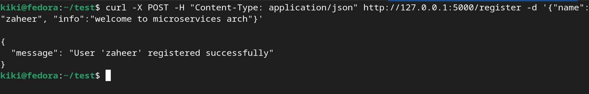

### **Project Goal: From Monolith to Microservices**

This project demonstrates a fundamental shift in modern application development: breaking down a single, monolithic application into a collection of smaller, independent microservices. The primary goal is to build a high-performance, scalable system where different components can be developed, deployed, and scaled independently. The entire ecosystem, comprising four distinct services, is designed to run cohesively using Docker and Docker Compose.

-----

### **🏛️ Architecture**

  

### **🏛️ A Deeper Look at the Architecture**

The application is split into four main components, each running in its own Docker container. This separation of concerns is a core tenet of microservices.

  * **User Service (Write Operations)**: This service, defined in `user-service/`, exposes a `/register` endpoint. Its sole responsibility is to receive new user data via a `POST` request and write it directly into the PostgreSQL database. It's a focused "write-only" API.

  * **Data Service (Read Operations)**: This service, located in `data-service/`, is engineered for high-speed data retrieval. It exposes a `/user/<name>` endpoint using a `GET` request. Its logic is more complex, as it incorporates the caching strategy to minimize database load and reduce latency.

  * **PostgreSQL 🐘 (The Source of Truth)**: This is the primary, persistent database. All user data is permanently stored here on disk. The `init.sql` file automatically creates the `usersdata` table and seeds it with initial data, ensuring the environment is ready upon startup.

  

  

  * **Redis ⚡ (The Speed Layer)**: Redis serves as a high-speed, in-memory cache. Because it stores data in RAM instead of on a hard disk, read operations are significantly faster than querying the PostgreSQL database. This is the key to the application's performance.

-----

### ** Architecture Visualization **
[Architecture Visualization](micro.html)


### **🔁 The Caching Strategy: "Cache-Aside"**

To ensure fast read times, this project implements a "cache-aside" pattern. The `Data Service` is the decision-maker in this flow.

#### **Cache Miss 🤷‍♂️**

1.  A client requests user data for the **very first time**.
2.  The `Data Service` checks the **Redis cache** for this data.
3.  The data is **not found**—this is a **"Cache Miss"**.
4.  The service then queries the primary **PostgreSQL database** to get the information.
5.  It returns the data to the client **AND** saves a copy in the Redis cache for future requests.

This first request is naturally slower because it involves a disk-based database lookup.

#### **Cache Hit 🎯**

1.  The same client (or another) requests the **same user data again**.
2.  The `Data Service` checks the **Redis cache**.
3.  The data is **found**—this is a **"Cache Hit"**.
4.  The service instantly returns the data from Redis without ever touching the slower PostgreSQL database.

This second request is extremely fast, as it's served directly from memory. This strategy is crucial for applications that have many more read operations than write operations.

-----

### **🐳 Containerization with Docker & Docker Compose**

The magic that holds this all together is containerization.

  * **Dockerfile**: Each service (`user-service` and `data-service`) has its own `Dockerfile`. This file is a blueprint that defines the service's environment. It starts from a base Python image, installs the necessary libraries from `requirements.txt` (`Flask` and `psycopg2-binary`), copies the application code, and specifies the command to run the Flask server.

  * **Docker Compose (`docker-compose.yml`)**: This file is the orchestrator. It defines all four services (`user-service`, `data-service`, `postgres`, `redis`) and how they interact.

      * **Networking**: Docker Compose creates a virtual network, allowing containers to communicate with each other using their service names as hostnames (e.g., the `user-service` connects to the database at `host=postgres`). This is a more robust solution than using IP addresses, which can change.
      * **Dependencies**: It uses `depends_on` to ensure services start in the correct order (e.g., the services don't start until the database is ready).
      * **Volumes**: It uses a named volume (`pgdata`) to persist the PostgreSQL data, ensuring that user information isn't lost even if the container is removed.

-----

### **▶️ Running the Project**

You can get the entire microservices ecosystem running with a single command:

1.  **Build and Run the Containers**:

    ```bash
    docker compose up --build
    ```

    This command tells Docker Compose to build the images for the services (if they don't exist) and then start all four containers.

    Once the application is up run below command to see application response,

     ```bash
    curl http://127.0.0.1:5000/
    ```

    


2.  **Register a New User**:
    Open a new terminal and use `curl` to send a `POST` request to the `user-service`.

    ```bash
    curl -X POST -H "Content-Type: application/json" http://127.0.0.1:5000/register -d '{"name":"zaheer", "info":"welcome to microservices arch"}'
    ```

    This command registers a user named "zaheer".

    

    

3.  **Retrieve User Data**:
    Now, use `curl` to send a `GET` request to the `data-service`.

    ```bash
    curl -X GET http://127.0.0.1:5001/user/zaheer
    ```
    The first time you run this, it will be a "Cache Miss" as the data does not exist in Redis Cache.

    

    If you run it a second time, it will be a "Cache Hit" and should return much faster.

        